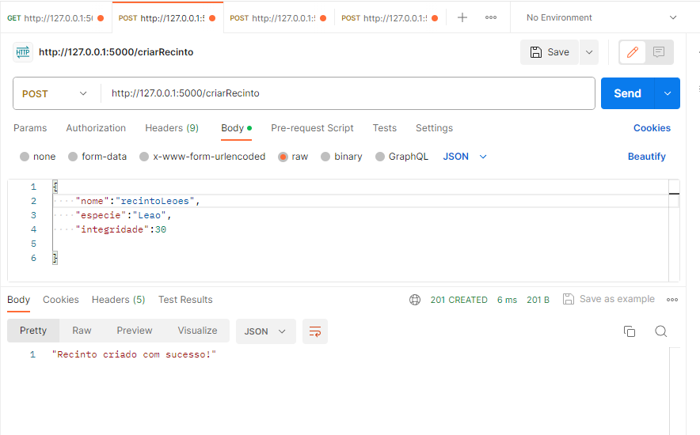
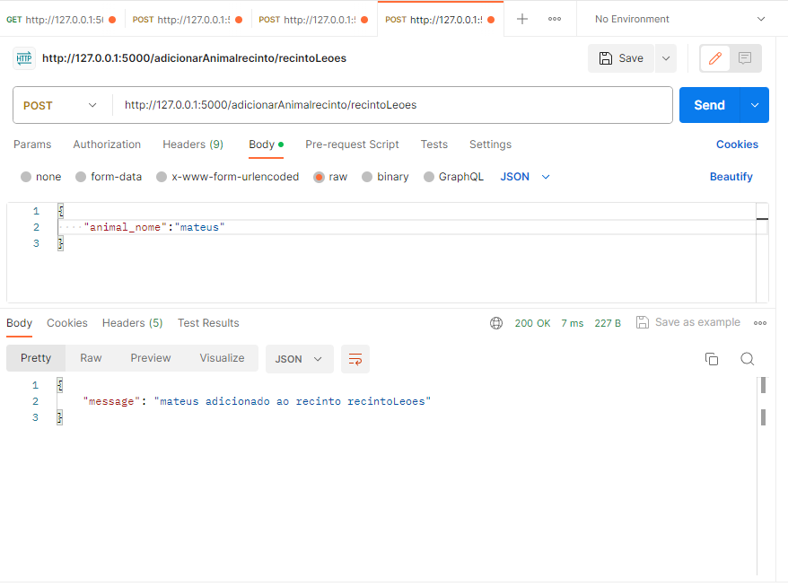
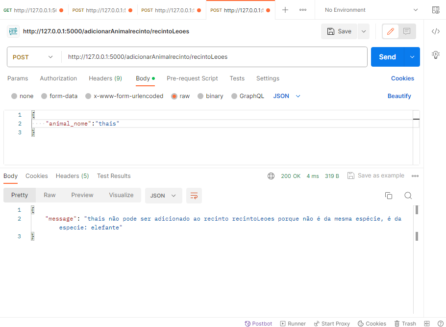

# atividadeSemana3M6

Atividade realizada:
Testes da API:

<h1>Criar animal:</h1> 
  

<h1>Criar recinto:</h1> 
  

<h1>Adicionar animal ao recinto certo:</h1> 
  

<h1>Adicionar animal ao recinto errado:</h1> 
  
